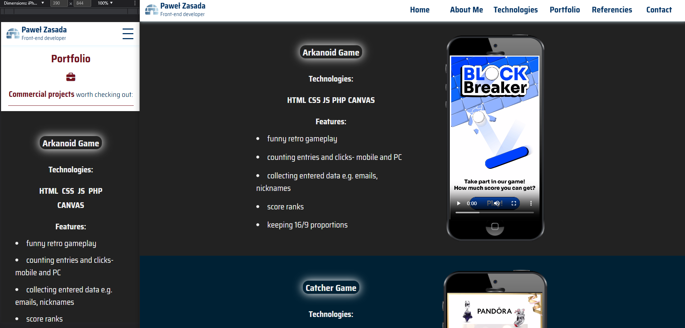
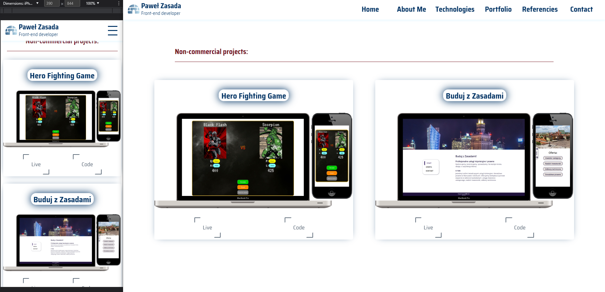

# My brand new portfolio
Website showing information about me- skills, projects, referencies.

## Table of contents
* [Technologies](#technologies)
* [Functionalities](#functionalities)
* [Screens](#screens)
* [Live](#live-star2)

## Technologies
Project was created with:
* HTML5
* CSS3
* JavaScript
* Animate On Scroll
* Swiper.js

## Functionalities
In project You are able to:
* Read a little bit about me, watching great animations the same time,
* see what technologies and tools I use,
* check out my projects portfolio- live and code versions,
* look into recommendations,
* contact me.

## Screens  

## Live :star2:
https://zasada94.github.io/zasadaportfolio/
